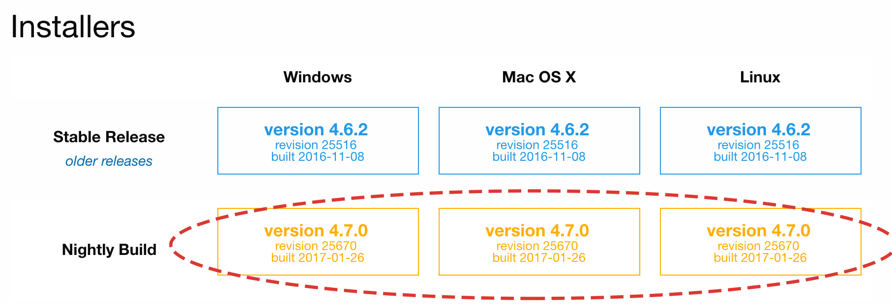

# Installation and upgrade

`Radiomics` should be available as an extension in the nightly version of 3D Slicer, starting <date to be inserted>. We always suggest that you use the latest (nightly) version of the software when you try it for the first time.

Download the latest nightly release for your platform from http://download.slicer.org.

**Do NOT use installers tagged as "Stable Release"!**

After downloading, follow the installation procedure for your platform.

If you use Mac, make sure you move the Slicer application to the Applications folder on your computer before launching it!

Once installed, open Extension Manager by clicking the icon as shown below.

Search for `Radiomics` and install the extension by clicking the INSTALL button.

Once installation of `Radiomics` is completed, you will need to restart Slicer application to access the module.

If installation was successful, you should be able to see `Radiomics` module in the Slicer module list.

It is currently not possible to upgrade `Radiomics` without upgrading the 3D Slicer application.

If you need to upgrade the software, download the latest nightly release of 3D Slicer and install the `Radiomics` extension as described above.

# Usage

1. Load image volume into 3D Slicer.

2. Segment the area of interest, or load segmentation from file.

3. Select image and segmentation in the Radiomics module interface.

4. Push "Apply" button to calculate the features!

More extensive instructions on the usage will be added soon - stay tuned!
